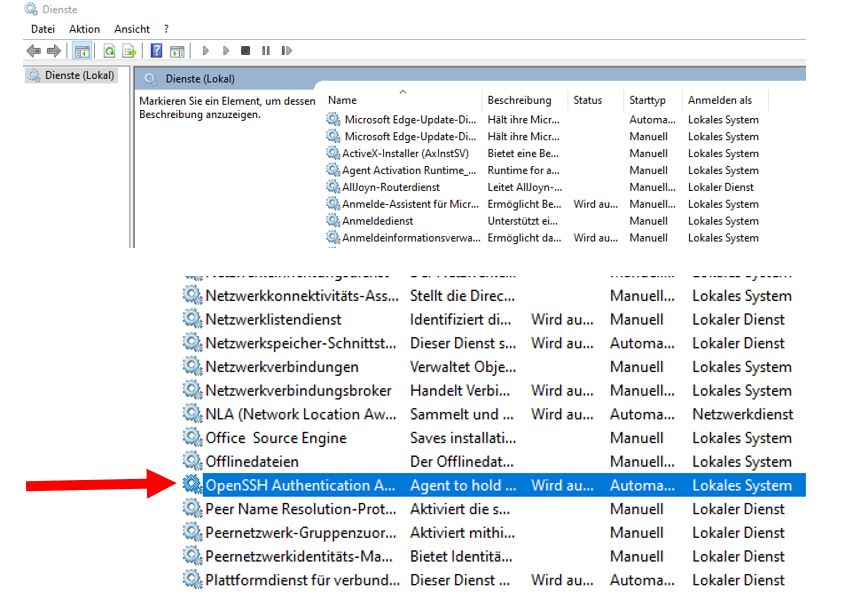
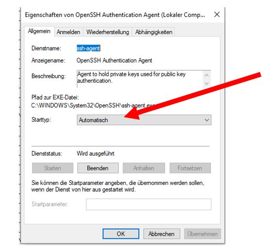
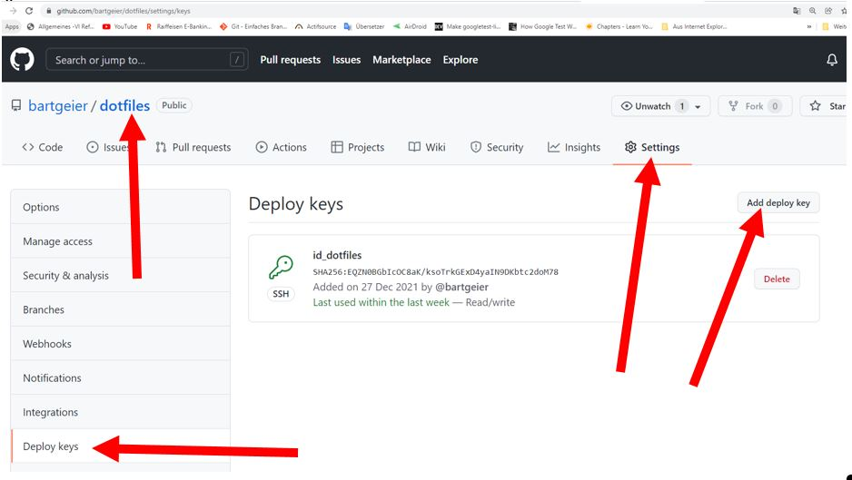
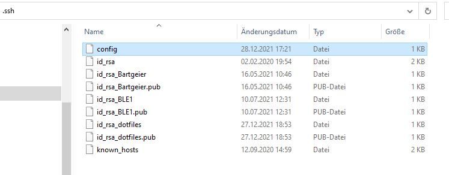

# ssh Key and Github – repository

A simple solution is to associate an ssh key with the user so that the user
has acces to all repos (in the github profile). In the .ssh directory is no
config means no redirection and therefore it used the standart id_rsa and
id_rsa.pub files.

A second solution is to give the user one key to access only one repo. 
Every repo has it's own keys.

This document discribed the second solution.
If you go along the way with the second solution. The simple solution is not
anymore possible. So you have to make a decision. As an example I use here my 
Linux dofiles project on a Windows computer.

On my Linux computer I use a git bare repository to manage my dotfiles.  
see:  
DistroTube Git Bare Repository - A Better Way To Manage Dotfiles  
https://youtu.be/tBoLDpTWVOM  
https://www.atlassian.com/git/tutorials/dotfiles  

# Microsoft Windows 10

Windows key write services.exe
Do this settings and restart your computer.



# SSH Key

Use powershell and jump into your .ssh directory.
PS C:\> cd C:\Users\xxx\\.ssh

## Generate key

https://docs.github.com/en/github/authenticating-to-github/generating-a-new-ssh-key-and-adding-it-to-the-ssh-agent
```
PS C:\Users\xxx> ssh-keygen -t ed25519 -C "your_email@example.com"
Generating public/private ed25519 key pair.
Enter file in which to save the key (C:\Users\xxx/.ssh/id_ed25519): C:\Users\xxx\.ssh\id_rsa_dotfiles
Enter passphrase (empty for no passphrase):
Enter same passphrase again:
Your identification has been saved in C:\Users\xxx\.ssh\id_rsa_dotfiles.
Your public key has been saved in C:\Users\xxx\.ssh\id_rsa_dotfiles.pub.
The key fingerprint is:
SHA256:AFh5k3QSiJh4Y/+pSIoJ6wNsuSqdRDYJZUrULhkpM0E your_email@example.com
The key's randomart image is:
+--[ED25519 256]--+
|=E=+o++o.        |
|X=*.o.+o         |
|o*++ ...         |
| o=..  .         |
|.oo. . .S        |
|o+o   o          |
|=B.o .           |
|*o+ .            |
|=..              |
+----[SHA256]-----+
PS C:\Users\xxx>
```
Two Files are created:
private key: id_rsa_dotfiles
public key:  id_rsa_dotfiles.pub

## Deploy key on your Github repo

Copy the content of the public Key "id_rsa_dotfiles.pub" into your Github repo.
 

## Add a redirection to the config file

If config file doesn't exist create it.
Then add Host dotfiles.github.com.

config file:
```
Host 3D_Viewer.github.com
  HostName github.com
  AddKeysToAgent yes
  IdentityFile C:/Users/xxx/.ssh/id_rsa_Bartgeier
Host Show_3d.github.com
  HostName github.com
  AddKeysToAgent yes
  IdentityFile C:/Users/xxx/.ssh/id_rsa
Host BLE1.github.com
  HostName github.com
  AddKeysToAgent yes
  IdentityFile C:/Users/xxx/.ssh/id_rsa_BLE1
Host dotfiles.github.com
  HostName github.com
  AddKeysToAgent yes
  IdentityFile C:/Users/xxx/.ssh/id_rsa_dotfiles
```
The config file playes the magic.  
If we communicate with git to gitHub: push, pull, ect  
**Then the config file does a redirection:**  
git@dotfiles.github.com:bartgeier/dotfiles.git  
becomes to:  
git@github.com:bartgeier/dotfiles.git  

 

# Rename url in your git project

Jump into dotfiles project directory.  
This renaming is nesseccary to get the redirection work.
```
PS C:\Projekts\Linux\dotfiles> git remote -v
origin  git@github.com:bartgeier/dotfiles.git (fetch)
origin  git@github.com:bartgeier/dotfiles.git (push)
PS C:\Projekts\Linux\dotfiles> git remote set-url origin git@dotfiles.github.com:bartgeier/dotfiles.git
PS C:\Projekts\Linux\dotfiles> git remote -v
origin  git@dotfiles.github.com:bartgeier/dotfiles.git (fetch)
origin  git@dotfiles.github.com:bartgeier/dotfiles.git (push)
PS C:\Projekts\Linux\dotfiles> git push
Everything up-to-date
PS C:\Projekts\Linux\dotfiles>
```
Or if your repo not exist yet. Create it:

git init  
git remote add origin git@dotfiles.gihub.com:bartgeier/dotfiles.git  
git pull origin master  


